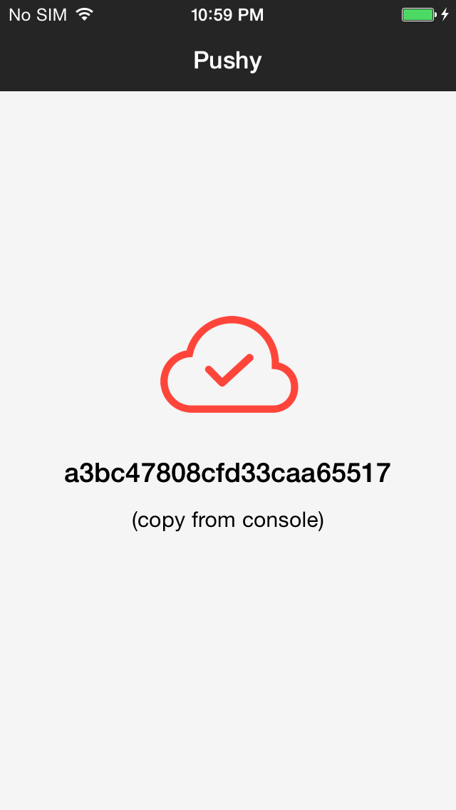
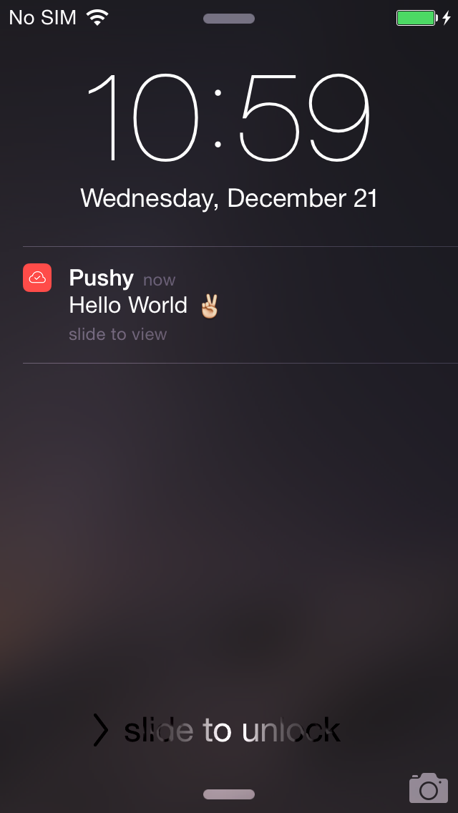

# pushy-demo-flutter

A demo of the [Pushy SDK for Flutter](https://github.com/pushy/pushy-flutter) integrated into a sample Flutter app.

> [Pushy](https://pushy.me/) is the most reliable push notification gateway, perfect for real-time, mission-critical applications.

This app registers your device to receive push notifications and assigns it a unique token, which you can copy and paste into the [demo page](https://pushy.me/docs/resources/demo) to send yourself a test push notification on both Android and iOS.

Visit our documentation to [integrate Pushy into your existing Flutter app](https://pushy.me/docs/additional-platforms/flutter).

## Screenshots

#### iOS

  

#### Android

 

## Get Started

* Make sure you have a healthy installation of Flutter: `flutter doctor`
* Clone the repository locally: `git clone https://github.com/pushy/pushy-demo-flutter.git`
* Run `cd pushy-demo-flutter`
* Run `flutter run` to run the app on either an emulator or a connected Android device
* Observe the Android logcat for the Pushy device token and paste it into the [demo page](https://pushy.me/docs/resources/demo) to send yourself a test notification
* For iOS, open the `ios/Runner.xcworkspace` file in Xcode, select your physical device, update the Signing Team in the project properties, and press **Run** to run the app on your iOS device
* Copy the device token from the Xcode console and paste it into the [demo page](https://pushy.me/docs/resources/demo) to send yourself a test notification

## More Information

* [Pushy](https://pushy.me/)
* [Pricing](https://pushy.me/pricing)
* [Documentation](https://pushy.me/docs)

## License

[Apache 2.0](LICENSE)
